<!--
  Profile README — telemetry / terminal-adjacent layout (no capsule-render clone).
  Animations: local SVG (SMIL) + readme-typing-svg; stats cards optional below.
-->

  

  

  
  
  

<table align="center">
  <tr>
    <td align="center" valign="top" width="33%">
      <strong>Now</strong> 
      Computer Science · Ohio University · Marietta, OH  
      Turning curiosity about memory, concurrency, and persistence into repos you can clone and run.
    </td>
    <td align="center" valign="top" width="34%">
      <strong>Trajectory</strong> 
      TypeScript · C# · Python · Go · embedded · databases  
      Exploring the seam where hardware constraints meet software ergonomics — plus full-stack surfaces and AI-side experiments across personal, coursework, and Skevia LLC repos.
    </td>
    <td align="center" valign="top" width="33%">
      <strong>Signal</strong> 
      Latest fixation  
      <strong>Skevia OS</strong> — a unified OS concept blending ideas from Qubes, macOS, and Ubuntu into something coherent enough to prototype. Shipping through <a href="https://github.com/SKEVIALLC">Skevia LLC</a>; public surface is <a href="https://github.com/SKEVIALLC/Skevia-Website">Skevia-Website</a>, with the rest of the active org stack folded under <strong>Private sandboxes</strong> below.
    </td>
  </tr>
</table>

 

  
  

<strong>Toolbox</strong> — languages, platforms, and the usual suspects

 

  

 

<strong>Projects worth a stop</strong>

| | |
| :--- | :--- |
| **[bartender-boys](https://github.com/Ohio-University-CS/bartender-boys)** | Ohio University CS project (**archived**): AI bartender automation — TypeScript. |
| **[Skevia-Website](https://github.com/SKEVIALLC/Skevia-Website)** | Skevia LLC site shell and styling — CSS. |
| **[Blackhole](https://github.com/Jskeen5822/Blackhole)** | Interactive playground for gravity wells and orbital mechanics — JavaScript. |
| **[Brainrot Doomscroller](https://github.com/Jskeen5822/Brainrot-Doomscroller)** | Generative art riff on viral culture — creative coding with teeth — JavaScript. |
| **[BidBuilder](https://github.com/Jskeen5822/BidBuilder)** | Construction bidding for companies and individuals — JavaScript. |
| **[Memorymanager](https://github.com/Jskeen5822/Memorymanager)** | Simulated dynamic memory allocation — C++. |

 

<strong>More public repos</strong> — Jskeen5822

 

| | |
| :--- | :--- |
| **[Personal-Website](https://github.com/Jskeen5822/Personal-Website)** | Personal site — CSS. |
| **[SQL-and-Aggregate-Databases](https://github.com/Jskeen5822/SQL-and-Aggregate-Databases)** | Fetch repo data into SQL and compute aggregates — Python. |
| **[Hackers-Gauntlet](https://github.com/Jskeen5822/Hackers-Gauntlet)** | C++ exercise set. |
| **[Tornado](https://github.com/Jskeen5822/Tornado)** | JavaScript project. |
| **[REST-API-Assignment](https://github.com/Jskeen5822/REST-API-Assignment)** | Python REST API coursework. |
| **[ML-project](https://github.com/Jskeen5822/ML-project)** | ML automation experiments — Python. |
| **[Currencyconverter](https://github.com/Jskeen5822/Currencyconverter)** | Convert amounts between currencies. |

 

<strong>Private sandboxes</strong> — not on the profile chart, still real

 

**Jskeen5822:** Workspace (C#), Experiments (Python), Project-Conrad (Go, MIT).

**SKEVIALLC:** Vocari (C#), Luma (TypeScript), Skevia-App (HTML), Zephra (Python), Veks-AI (Python), Skevia-Studios (JavaScript), Perea (C), JustOne (TypeScript).

 

  
  
  

  

