<!--
  Dark Space Theme Profile README for Jonathon Skeen
-->

  

  

  

  

---

  

I am a computer science student exploring low-level systems, hardware-software integration, and scalable backend foundations.

- Studying Computer Science at Ohio University
- Building projects with dynamic memory, databases, and automation
- Deep interest in embedded systems and operating systems
- Actively shipping experimental and simulation-focused builds

---

  

- **Current Project:** **Skevia OS**  
  A unified operating system concept inspired by Qubes, macOS, and Ubuntu.
- **Learning:** Databases and Embedded Systems
- **Reach me at:** [jonathoncskeen@gmail.com](mailto:jonathoncskeen@gmail.com)

---

  

  

---

  

- **Brew Bot (AI Bartender)**  
  Hardware + software automation project for intelligent drink mixing.
- **Brainrot Art**  
  Generative art experience centered on viral culture and creative coding.
- **Blackhole**  
  Interactive simulation for gravity wells and orbital mechanics.

---

  

  

1. Fade and slide section reveal
2. Staggered list item entrances
3. Lift and glow card motion
4. Drifting gradient field
5. Pulsing border and shadow ring
6. Floating and rotating decorative shapes
7. Scanning divider beam
8. Typing text with cursor blink
9. Wave and twinkle star field
10. Looping SVG motion embed

---

  

  
  
  

---

  

